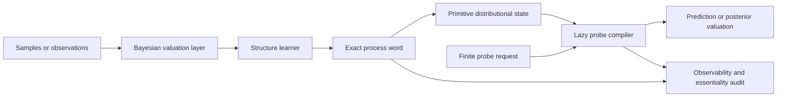

# NOVA architecture

## Architectural decision

Keep the internal process algebra exact and potentially infinite. Compile only the requested observations into finite computations. This reverses the usual finite-model-first approach: NOVA does not approximate the approximator; it approximates what an observer asks of it.

## Components

1. **Exact process engine** stores generators and compositions as symbolic words. In the full theory these words come from a faithful non-sofic group action.
2. **Primitive state interface** supports `act(process)` and `probe(effect)` without asserting that every state is fundamentally a tensor or density.
3. **Lazy probe compiler** reduces a requested finite experiment to the smallest finite computation needed to answer it.
4. **Bayesian valuation layer** updates uncertainty about observable outcomes. The prototype uses Dirichlet smoothing; richer versions can use posterior processes or exchangeable models.
5. **Structure learner** proposes new symbolic operations based on external loss. The prototype greedily refines Cantor cylinders.
6. **Observability auditor** reports process collisions under the active probes. The future essentiality auditor must also prove that the complete observable quotient remains non-sofic.

## Training loop

1. Receive samples and a finite family of questions.
2. Evaluate current process words only through those probes.
3. Score posterior predictive loss and uncertainty.
4. Propose a symbolic refinement or process composition.
5. Accept it if held-out valuation improves after a complexity penalty.
6. Replay the exact process log and run the collision audit.
7. Expand the probe family where collisions matter.

## Scaling path

- Replace exhaustive finite states with sparse cylinder tries.
- Learn probe selection by expected information gain.
- Add Fourier, characteristic-function, and Mellin probes for periodicity, tails, and scale.
- Use a neural policy to propose symbolic words while retaining exact verification.
- Move from one distribution to operator-valued states, making the design closer to a neural operator with an auditable algebraic core.

## Safety and correctness constraints

- Never infer equality from agreement on an incomplete probe set.
- Never label a finite implementation “non-sofic.”
- Preserve the exact process log so results are replayable.
- Compare against an ordinary universal baseline to detect decorative complexity.
- Treat the explicit non-sofic theorem and the essentiality theorem as separate gates.

