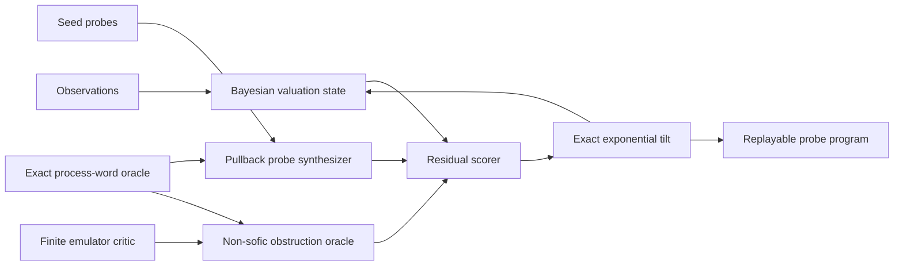

# OASIS system architecture

## Requirements

### Functional

- Store and compose exact process words.
- Generate probes by exact pullback and typed composition.
- Maintain Bayesian estimates of external valuations.
- Detect observational aliases without declaring process equality.
- Challenge finite process emulators and preserve obstruction witnesses.
- Replay every learned prediction exactly from its probe program.

### Non-functional

- Deterministic, auditable program logs.
- Lazy finite computation: evaluate only requested probes and frontier candidates.
- Pluggable process and valuation realizations.
- Explicit separation between theorem-backed non-sofic claims and finite engineering tests.

## Components



## Core interfaces

```text
ProcessOracle.reduce(word) -> exactWord
ProcessOracle.compose(left, right) -> exactWord
Probe.pullback(exactWord) -> generatedProbe
Probe.compose(otherProbe) -> generatedProbe
Valuation.posterior(probe, observations) -> moment, uncertainty
Emulator.fit(finiteChart) -> proposedFiniteMultiplication
Obstruction.challenge(emulator) -> failedTriangles, forcedAliases
Program.replay(seedState) -> externalPrediction
```

## Training transaction

1. Freeze the current exact process word and posterior snapshot.
2. Generate a bounded probe frontier lazily.
3. Score residual, alias separation, and derivation complexity.
4. Commit one exact probe derivation and Bayesian tilt atomically.
5. Verify replay and update the observable process chart.
6. If verification fails, reject the transaction without changing the state.

## Storage

- Append-only process-word and probe-derivation log.
- Content-addressed probe expressions so repeated pullbacks are shared.
- Posterior sufficient statistics keyed by probe identity.
- Obstruction witnesses stored with the emulator version they refuted.
- Cached valuations are disposable; exact words and derivations are authoritative.

## Scaling

- Enumerate the probe grammar by description length and posterior information gain.
- Evaluate candidates in parallel because their valuations are conditionally independent.
- Use sparse moment sketches before exact evaluation, but never use them to assert process equality.
- Prune probes by posterior redundancy while keeping their derivations in the audit log.
- Introduce neural proposal policies only to rank exact candidates; the verifier remains symbolic.

## Tradeoffs

- Obstruction preservation can temporarily reduce predictive accuracy under a tight probe budget.
- Exact word manipulation may dominate runtime when the group has a difficult word problem.
- A separating probe algebra may grow too quickly without good information-gain bounds.
- Universal representation is not efficient learnability; both need separate results.
- The emulator critic adds compute but gives a concrete way to prevent silent collapse into a finite sofic surrogate.

## What changes at scale

The finite implementation enumerates all 255 nonconstant probes. An infinite implementation cannot. It must combine description-length search, Bayesian uncertainty, obstruction-directed generation, and reusable exact derivations. The architecture should be revisited once an effective action and obstruction witness for the chosen non-sofic group are available.

