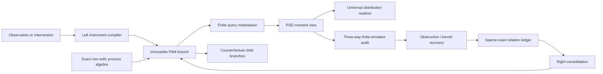

# Projective Algebraic Memory: memory as a positive functional

## The missing object

The earlier AION design said that only a finite part of an infinite semantic object is materialized at any moment. That is true, but incomplete. A lazy tree, database cursor, or program can already do that. The additional structure needed for **memory** is compatibility: every finite recollection must be a view of the same underlying state.

The load-bearing object is a normalized positive functional

\[
\omega:\mathbb R[G]\longrightarrow\mathbb R,
\qquad
\omega(1)=1,
\qquad
\omega(a^*a)\ge 0.
\]

For each finite process window `F`, it materializes the moment view

\[
M_F(u,v)=\omega(u^{-1}v),\qquad u,v\in F.
\]

Every `M_F` is positive semidefinite. If `F` is contained in a larger window `F'`, then `M_F` is exactly the corresponding principal submatrix of `M_F'`. Refinement changes the view, not the semantic object.

This is **Projective Algebraic Memory**, or **PAM**. AION uses PAM as its non-finite continuous internal memory.

## Why this is memory

PAM separates the semantic state from any one physical materialization:

```text
                         one positive functional omega
                                      |
              +-----------------------+-----------------------+
              |                       |                       |
        finite view F1          finite view F2          finite view F3
        moments / recall        moments / recall        moments / recall
              |                       |                       |
              +---------- exact overlap consistency ---------+
```

This gives precise versions of familiar memory operations:

- **Recall** materializes the moments needed by the present query.
- **Learning** updates the functional through evidence.
- **Forgetting** enlarges the functional's nullspace.
- **Consolidation** stores a verified nullspace as a sparse exact quotient relation.
- **Association** is a nonzero off-diagonal moment between exact contexts.
- **Imagination** proposes higher moments or extensions consistent with existing moments and positivity.
- **Confabulation** is a proposed family of finite views that fails overlap consistency or has no positive extension.

The semantic memory can therefore be defined by how it answers all probes, rather than by the coordinates currently used to store it.

## Three different kinds of equality

This architecture must never conflate:

1. **Algebraic equality:** two words denote the same exact group element.
2. **State-specific remembered equality:** distinct group elements differ algebraically but their difference lies in the kernel of `omega`.
3. **Finite-emulator aliasing:** an approximate student accidentally maps distinct elements to the same finite behavior.

The prototype demonstrates the distinction. For an exact involution `g`, the amplitude

\[
B=1+g
\]

defines a positive state for which

\[
(1-g)B=1-g^2=0.
\]

Thus identity and `g` remain distinct in the exact non-sofic group, while the current memory state deliberately identifies them. The corresponding two-element moment view has exact rank one. This is genuine state-dependent forgetting, not an arithmetic collision.

## Continuous and non-finite

PAM is continuous in two senses:

- the convex state space of positive normalized functionals is continuous; and
- its moments and likelihood amplitudes can take real or computable-real values.

It is non-finite in a stronger sense than “a large array.” For the canonical trace,

\[
\omega(g)=\mathbf 1[g=e],
\]

the moment matrix on any finite set of distinct group elements is an identity matrix. Because the internal group is infinite, the ranks of these exact finite views are unbounded. Consequently no fixed finite-dimensional vector can reproduce all of them.

This is not confined to the canonical trace. Let `B` be any nonzero
finite-support amplitude and let `S=supp(B)`. Since `G` is infinite, for every
`n` one can choose `g_1,...,g_n` so that the finite sets `g_i S` are pairwise
disjoint. Inductively, the next `g` need only avoid the finite forbidden set

\[
\bigcup_i g_iSS^{-1}.
\]

The vectors `g_iB` are then nonzero, pairwise orthogonal, and have the same
norm. Their normalized moment view is exactly `I_n`. Therefore **every nonzero
finite-support PAM state has unbounded exact moment rank**. All finite
consolidation and nonzero observation histories in the current implementation
remain in this class.

At every physical instant the program, cache, and query are finite. The non-finite claim concerns the semantic interface and the absence of a fixed finite sufficient representation across all refinements. It does not claim that a computer stores literally infinitely many bits at one time.

## Two exact update rules—and why they must not be confused

The executable prototype represents a positive state by an amplitude `B` in the exact rational group algebra:

\[
\omega_B(a)=\frac{\tau(B^*aB)}{\tau(B^*B)},
\]

where `tau` extracts the identity coefficient.

The prototype originally described every amplitude update as evidence. That was
too loose. In a noncommutative algebra, the side of multiplication changes the
meaning.

A **right update**

\[
B\longmapsto BK.
\]

is a kernel-preserving consolidation. If an exact remembered relation satisfies
`rB=0`, then

\[
r(BK)=(rB)K=0.
\]

Verified left-kernel memories therefore persist automatically. Right updates
can be noncommutative and order-sensitive, but for left observables they live in
the commuting action and should not be called measurements.

A genuine **observation or intervention** acts on the left:

\[
B\longmapsto KB.
\]

This can revise old state-specific relations. The implementation retains every
relation in the ledger and explicitly marks the version and operation that
invalidated it. Memory revision is therefore auditable rather than silent.

For an exact involution `g`, the two observable filters are `1+g` and `1-g`.
Their exact forecast probabilities are

\[
p_+=\frac{1+\omega_B(g)}{2},\qquad
p_-=\frac{1-\omega_B(g)}{2},\qquad p_++p_-=1.
\]

Conditioning on an outcome creates an immutable child state

\[
B_+=(1+g)B\quad\text{or}\quad B_-=(1-g)B,
\]

while leaving the parent unchanged. Each nonzero child carries its outcome
relation as an exact kernel certificate. Recursing this operation produces a
finite materialized tree of counterfactual futures whose leaf probabilities
sum exactly to one. The unmaterialized continuation is still denoted by the
same branching program.

In a commutative observable algebra, a left likelihood-amplitude filter recovers
ordinary Bayesian reweighting. In the noncommutative setting this is better
described as an instrument or postselection update; it should not be casually
equated with classical Bayes.

## System architecture



The exact group core determines composition. PAM determines the current distributional memory. The readout estimates requested observables. The emulator is disposable and may be used for speed, but its collisions are audited against exact algebraic truth and state-specific kernel truth.

## API and invariants

The prototype exposes these essential operations:

- `materialize(words)` returns an exact finite moment matrix.
- `fork(label)` copies the semantic state into an immutable counterfactual branch.
- `binaryObservation(word)` returns exact probabilities for an involutive probe.
- `postselectInvolution(...)` performs one exact left observation update.
- `branchOnInvolution(word)` returns both possible nonzero child states.
- `materializeCausalTree(words)` constructs an exact finite counterfactual tree.
- `update({terms, side: "right"})` performs kernel-preserving consolidation.
- `update({terms, side: "left"})` performs a kernel-revising intervention.
- `rememberNullRelation(terms)` accepts only an exactly zero state-specific relation.
- `compareWords(left, right)` separates algebraic equality from memory equivalence.
- `auditEmulatorPair(...)` adds emulator equality as a third truth layer.
- `certifyFiniteLatentDimension(words, d)` gives an exact rank obstruction.
- `certifyDisjointTranslateObstruction(words, d, n)` constructs an exact rank witness for the current updated state.
- `transport(word)` performs exact left-regular process transport.

Every materialization enforces:

- exact word evaluation;
- normalization;
- symmetry;
- positive semidefiniteness by explicit exact Gram factorization;
- exact rank computation; and
- equality of every previously materialized overlapping moment in the same state version.

Every right update rechecks all active consolidated null relations. Every left
update rechecks them and records any invalidation event.

## Executable result

The dedicated test produced:

```text
canonical trace coarse window       3 elements, exact rank 3
canonical trace refined window      6 elements, exact rank 6
unchanged overlapping moments       9 exact checks
canonical windows of size          3, 5, 7, 9, 11
their exact ranks                  3, 5, 7, 9, 11
best rank-2 normalized errors      .577, .775, .845, .882, .905
best rank-2 operator-norm error     1 at every tested size
nontrivial updated moment            4/5 exactly
updated refined window              6 elements, exact rank 6
updated overlap checks              16 exact checks
PSD verification                    exact Gram factorization passed
two update orders                   different exact states
distinct identity and g             preserved algebraically
state-specific {identity,g} view    exact rank 1
stored null relation                exact squared norm 0
null relation after later update    still exact squared norm 0
root involution probabilities       1/2 and 1/2 exactly
two child memories                  moments +1 and -1 exactly
parent after branching              unchanged
depth-two causal tree               4 leaves, each probability 1/4
causal-tree probability total       1 exactly
old relation after incompatible
left observation                    explicitly marked invalidated
emulator aliases at root            refuted by memory
same alias in conditioned child     memory-valid but algebraically false
twice-observed amplitude support     4 exact terms
candidate translates inspected      6
pairwise-disjoint translates found  6
twice-observed moment rank           6 exactly
latent dimension rejected           3
normalized rank-3 error bound        1/sqrt(2)
```

The full existing OASIS test suite remains independent and passing.

For the canonical trace on `n` distinct group elements, the moment matrix is
`I_n`. Any latent Gram representation of dimension at most `d<n` has exact
best-possible squared Frobenius error at least `n-d`, normalized Frobenius error
at least

\[
\sqrt{\frac{n-d}{n}},
\]

and operator-norm error at least one. For every fixed `d`, the normalized lower
bound approaches one as the queried window grows. This is an unconditional
finite-latent obstruction for these views; it does not rely on the unresolved
effective non-sofic radius.

## Connection to the radius-two theorem gap

The SOS dual search has been constructing truncated positive functionals all along. Its block moment matrices are finite memory views. Facial reduction searches for directions that every admissible view must forget.

This changes the interpretation of the unresolved radius-two kernel:

- a numerical near-null eigenvector is a tentative remembered equivalence;
- an exact rational null relation is a consolidated memory;
- quotienting by the kernel is architectural compression with proof;
- a failed PSD extension is a confabulation detector; and
- increasing radius asks whether the remembered state extends consistently to deeper polynomial queries.

The theorem and architecture programs are therefore coupled. Sparse exact kernel recovery improves both the non-soficity certificate pipeline and PAM's memory compiler.

## What non-soficity contributes—and what it does not

Positive-functional memory and unbounded-rank moment states exist for many infinite groups. They are not consequences of non-soficity.

Non-soficity contributes a different guarantee: the exact multiplication law cannot be recovered by the prohibited sequence of globally faithful finite permutation almost-actions. It makes finite emulators intrinsically auditable shadows rather than candidates for replacing the core.

PAM must still select or learn an infinite-rank state if non-finite memory is desired. A non-sofic group may also possess finite-dimensional representations or low-rank states. The two properties are deliberately coupled, not logically conflated.

## Scaling and reliability

The prototype favors truth over speed. With amplitude support `s` and query window `n`, naive exact materialization can require roughly quadratic work in both `n` and `s`, while rational numerator sizes grow under repeated updates.

The next implementation should add:

- canonical sparse multiplication caches;
- factor-form moment queries without expanding every matrix entry;
- exact relation rewriting before multiplication;
- checkpointed amplitude DAGs rather than repeatedly expanded polynomials;
- interval-valued computable-real coefficients;
- state-versioned views and rollback; and
- resource limits that never weaken exactness silently.

If support growth becomes excessive, the safe compression is an exact quotient or a certified error interval—not an unmarked floating approximation.

## The theorem candidates

Already established by construction for the implemented rational-amplitude subclass:

1. **Finite query computability:** every requested finite moment view is exactly computable.
2. **Projective consistency:** nested queries agree exactly on overlaps.
3. **Positivity:** every view has an exact Gram factorization.
4. **Kernel persistence:** stored left-null relations survive right consolidation updates.
5. **Unbounded finite-amplitude rank:** every nonzero finite-support amplitude state over the infinite group has arbitrarily large identity moment views.
6. **Exact binary branching:** involutive observation branches have rational probabilities summing exactly to one.
7. **Auditable revision:** left interventions never silently erase a previously certified kernel relation.
8. **Finite-latent obstruction:** the constructed `n`-element identity views cannot be reproduced by a latent Gram state of dimension below `n`, with explicit optimal error bounds.

Still open:

1. a compact-space universal density theorem for the complete AION/PAM readout;
2. convergence or regret bounds for obstruction-selected probes;
3. an effective universal non-sofic `(F,epsilon)` challenge;
4. automatic recovery of sparse exact kernels from noisy moment views; and
5. predictive or regret gains from rank-obstruction-selected probes rather than merely a representational separation.

## Novelty boundary

The surrounding mathematics and several neighboring ML ideas have clear prior art:

- positive functionals on group or operator algebras;
- GNS-style Hilbert-space realizations;
- quantum/noncommutative Bayesian state updates;
- functional and infinite-dimensional learned representations;
- learned moments and moment-SOS hierarchies; and
- neural networks for noncommutative symmetries;
- predictive-state representations, which already define state through predictions of future observations; and
- process tensors and quantum Markov order, which already represent intervention-sensitive multi-time processes.

Therefore the broad slogan “memory is the law assigning predictions to future
probes” is not a novelty claim. Nor is counterfactual process memory by itself.
The sharpened candidate object is:

> **An exact, positive, infinite-rank algebraic predictive state whose transition
> algebra is theorem-backed non-sofic, whose state kernels are proof-carrying
> memories, and whose finite-emulator failures synthesize new probes.**

A narrow search did not identify the complete PAM/AION synthesis:

1. exact projective moment views as query-dependent predictive recollection;
2. immutable exact counterfactual branches with an auditable kernel lifecycle;
3. a theorem-backed non-sofic group as the exact transition algebra;
4. a three-way separation of group equality, state-kernel equality, and emulator aliasing;
5. obstruction-driven probe generation and exact kernel consolidation; and
6. finite universal distribution heads that never replace the internal process.

This supports the description **conversation-original and apparently distinct in the searched literature**, not the legal conclusion that no prior art exists.

## Related primary work checked

- Aniello, [*Playing with functions of positive type, classical and quantum*](https://arxiv.org/abs/1411.1304).
- Schack, Brun, and Caves, [*Quantum Bayes rule*](https://arxiv.org/abs/quant-ph/0008113).
- Li and Principe, [*Functional Bayesian Filter*](https://arxiv.org/abs/1911.10606).
- Xu et al., [*MetaFun: Meta-Learning with Iterative Functional Updates*](https://proceedings.mlr.press/v119/xu20i.html).
- Ravuri et al., [*Learning Implicit Generative Models with the Method of Learned Moments*](https://proceedings.mlr.press/v80/ravuri18a.html).
- Chen et al., [*A Sublevel Moment-SOS Hierarchy for Polynomial Optimization*](https://arxiv.org/abs/2101.05167).
- Pearce-Crump, [*Compact Matrix Quantum Group Equivariant Neural Networks*](https://proceedings.mlr.press/v267/pearce-crump25a.html).
- Boots, Gordon, and Gretton, [*Hilbert Space Embeddings of Predictive State Representations*](https://arxiv.org/abs/1309.6819).
- Hefny et al., [*Recurrent Predictive State Policy Networks*](https://proceedings.mlr.press/v80/hefny18a.html).
- Pollock et al., [*Operational Markov Condition for Quantum Processes*](https://arxiv.org/abs/1801.09811).
- Taranto et al., [*The Structure of Quantum Stochastic Processes with Finite Markov Order*](https://arxiv.org/abs/1810.10809).
- White et al., [*Non-Markovian Quantum Process Tomography*](https://arxiv.org/abs/2106.11722).

## The next falsifiable experiment

Use a sequential task whose contexts are exact words and whose observations induce noncommuting instruments. Compare:

1. a finite-state recurrent model;
2. a kernel or functional Bayesian filter;
3. PAM without obstruction-selected refinement; and
4. full AION with PAM, exact audits, and kernel consolidation.

Measure predictive regret, moment-query cost, exact rank by radius, certified
rank-`d` approximation error, overlap consistency, relation invalidations,
algebraic collisions, emulator defects, and probes generated per obstruction.
The finite-support translate-rank theorem now covers every nonzero state reached
by a finite implemented observation history, not only the canonical trace. The
next decisive construction is an **obstruction-controlled predictive learner**:
use the escaping moment minor to choose the next probe, then show that this
choice improves predictive loss, calibration, or regret faster than ordinary
uncertainty sampling. That would connect exact non-finite memory directly to
adaptive learning rather than merely to representation.
